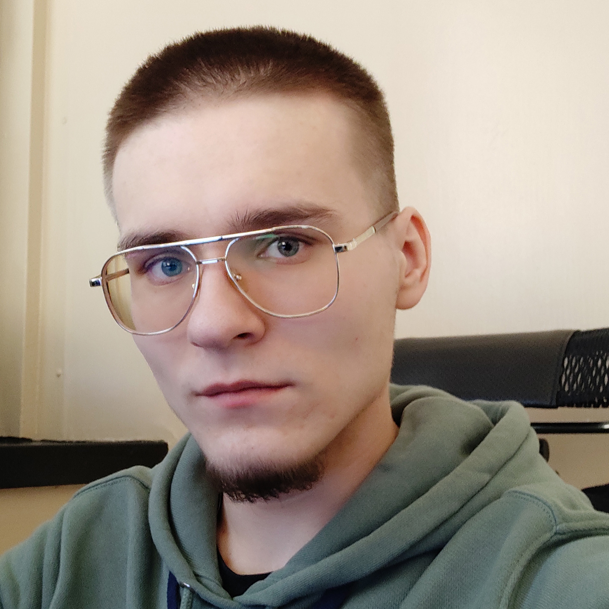

# Alexandr Burlakov  

----------  

### Contacts  

* Phone: **+7(964)594-33-22**  
* Telegram: **[HollowBeing](https://t.me/HollowBeing)**  
* E-mail: **hollow.being@yandex.ru**  
* Discord: 

### About me



I'm student from Russia, who want to make impact in future of our WEB.
RSSchool is my personal garantee that i'm on the right way to become a professional developer.

### Skills  

* HTML  
* CSS (SASS/SCSS)  
* JavaScript   
* Git, GitHub  
* Zeplin, Figma, Photoshop  
* SQL (For my current job)  

### Code  

#### **This is Kata frome [Codewars](https://www.codewars.com)**  
The task was to determine the minimum required number of objects that is needed for the specified number of handshakes.  
The solution needs to use combinations without repetition. 

```  

function getParticipants(handshakes){
  for (let i = 0;;i++){
    let combin = ((i - 1) * i) / 2;
    if(combin >= handshakes) return (i === 0) ? 1 : i;
    else continue;
  }
}

```  

### Education

* HTML and CSS Tutorials on the [w3schools](https://www.w3schools.com/) (in progress)  
* [Learn JavaScript](https://learn.javascript.ru/) (in progress)  
* Video courses and lections on YouTube  
* Student of MGUPP  

### Languages

* Russian - native
* English A2
